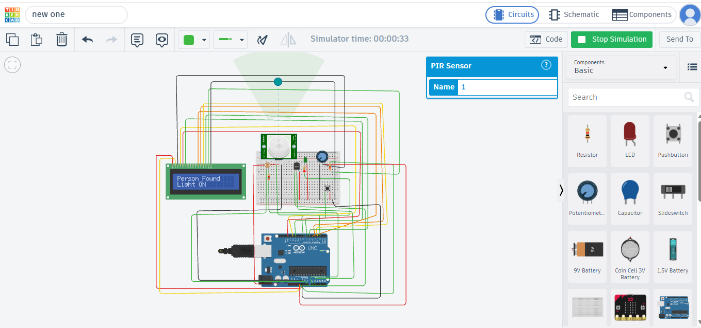

# Smart Classroom Automation and Energy Management System

## Overview

This project presents a smart classroom automation system designed to reduce unnecessary energy consumption and improve classroom efficiency.

The system is developed and tested as a Tinkercad simulation using Arduino UNO.

## Components Used

- Arduino UNO
- PIR Sensor
- LDR Sensor
- TMP36 Temperature Sensor
- 16x2 LCD
- LEDs
- Push Button
- Resistors
- Breadboard

## Working

- PIR sensor detects movement/presence in the classroom.
- LDR sensor detects the surrounding light level.
- TMP36 sensor measures temperature.
- Arduino UNO processes the sensor inputs and controls the outputs.
- LCD displays the classroom status.
- LEDs represent the classroom light and fan in the simulation.
- A push button can be used for manual control.

## Main Features

- Occupancy detection
- Automatic lighting control
- Temperature-based fan indication
- LCD status display
- Manual override
- Tinkercad circuit simulation

## Tools Used

- Arduino
- Tinkercad Circuits
- Embedded C / Arduino C

## Simulation

The complete circuit was designed and tested using Tinkercad.

## Project Screenshot

## Tinkercad Project

[Open Project in Tinkercad](https://www.tinkercad.com/things/dV9Xi1HLiAV-new-one/editel?returnTo=https%3A%2F%2Fwww.tinkercad.com%2Fdashboard&sharecode=uLCSS9pOwaS2FDXcUPR2LjUDimSoQz3_9V3yGunR6Z4)
